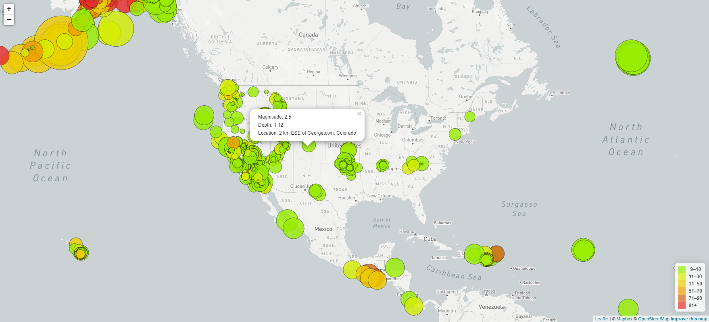
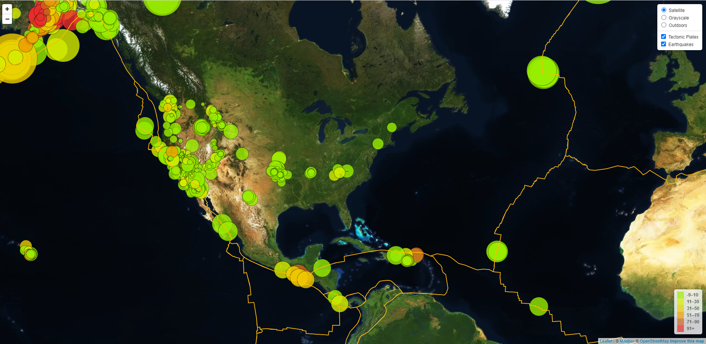

#### leaflet-challenge
# Visualizing Data with Leaflet

## Overview

Welcome to the United States Geological Survey, or USGS for short! The USGS is responsible for providing scientific data about natural hazards, the health of our ecosystems and environment; and the impacts of climate and land-use change. Their scientists develop new methods and tools to supply timely, relevant, and useful information about the Earth and its processes.

With earthquake data from the USGS, create a map using *Leaflet* and plot all of the earthqukes based on longitude and latitude. The size of the markers, or circles, should reflect the magnitude of the earthquake and the color should reflect the earthquake's depth; the bigger the circle, the bigger the earthquake and the darker the color, the deeper the earthquake. *Level 2* then takes that map and data and adds tectonic plates to illustrate the relationship between the tectonic plates and seismic activity. A second set of data was pulled in along with the original dataset. Two more base maps were added with the option to pick any one of the three. The two datasets are separated out into overlays that can be turned on and off.

### Files and Folders

#### Level 1
* [Leaflet-Step-1](Leaflet-Step-1/) - this folder holds all the files for this part of the challenge
    * [Main Page](Leaflet-Step-1/index.html) - this *index.html* file is the webpage that should be opened in a browser and displays the map.
        * [static](Leaflet-Step-1/static/) - this folder holds all the files and subfolders used to format and manipulate the webpage
            * [css](Leaflet-Step-1/static/css/) - this folder holds the stylesheet file that helps format the webpage
                * [style.css](Leaflet-Step-1/static/css/style.css) - this *CSS* file helps format the webpage
            * [js](Leaflet-Step-1/static/js/) - this folder holds the *JavaScript* file
                * [logic.js](Leaflet-Step-1/static/js/logic.js) - this file contains the *JavaScript* script that manipulates the *HTML* page; this file is for the **Level 1** part of the challenge
                * [config.js](Leaflet-Step-1/static/js/config.js) - this file contains the *Mapbox* API key that is needed for this webpage and will need to be created by the user (more details in the *[Notes](#Notes)* section below)

#### Level 2
* [Leaflet-Step-2](Leaflet-Step-2/) - this folder holds all the files for this part of the challenge
    * [Main Page](Leaflet-Step-2/index.html) - this *index.html* file is the webpage that should be opened in a browser and displays the map.
        * [static](Leaflet-Step-2/static/) - this folder holds all the files and subfolders used to format and manipulate the webpage
            * [css](Leaflet-Step-2/static/css/) - this folder holds the stylesheet file that helps format the webpage
                * [style.css](Leaflet-Step-2/static/css/style.css) - this *CSS* file helps format the webpage
            * [js](Leaflet-Step-2/static/js/) - this folder holds the *JavaScript* file
                * [logic.js](Leaflet-Step-2/static/js/logic.js) - this file contains the *JavaScript* script that manipulates the *HTML* page; this file is for the **Level 2** part of the challenge
                * [config.js](Leaflet-Step-2/static/js/config.js) - this file contains the *Mapbox* API key that is needed for this webpage and will need to be created by the user (more details in the *[Notes](#Notes)* section below)

## Development and Analysis

### Level 1: Basic Visualization

Since we need to use an access token for *Mapbox*, I started of by created the *config.js* file that contained my API key. Once that file was added to the *js* folder, I started working on the script. First task to do was to decide on the dataset I would be using from the USGS website. I chose *'All Earthquakes from the Past 7 Days'*. I added the URL for this *JSON* to the script and `console.log`-ed it to make sure it worked and to look at the data and structure. I created this script with the knowledge that I would be using it for the *Level 2* portion of the challenge as well so set it up the base layers and overlays options in mind. Since the size of the circles would represent the magnitudge of the earthquakes, I created a funtion to determine that. It took some trial and error to get the circles to display large enough.

Then I worked on the color for the circles which would represent the depth of the earthquake. Based on the example we had, I needed to add 6 different colors. With the help of [Coolors](https://coolors.co/gradient-palette/ea2c2c-98ee00?number=7), I got my 6 colors picked out. So I created a function to work with those. Once the coloring was added, it took some testing to get the `fillOpacity` set to the setting I wanted along with the `weight` of the circle border.

Next came the popups which proved more challenging than I expected. I could get them to display the data but the space between the lines of text in the popup box was really big. Used *Google Inspector* to finally track down the setting for that and added it to the *style.css* file. 

Had everything displaying correctly on the map so it was time to tackle the Legend. This part proved the most challenging of this *Level 1* portion. At first I could get the depths to show up but no colors and the Legend was transparent. Fixed a lot of the Legend formatting issues by adding style formatting information to the *style.css* file. Also realized I needed to move the color function out of the *createFeatures* function and just make it an independent function because it also needed to be used in the *createMap* function, which is where the Legend is created. the only part left with the Legend was to get the depths ranges to display correctly. They were displaying with duplicate start or end values. For example, *30-50* and then *50-70*, etc. Had to change my start value and then subtract 1 from the end value.

The end result is as follows:

### Level 2: More Data

Since *Level 2* builds on what was created in *Level 1*, I copied the files over from that section and used them as the starting point for *Level 2*. Since this level pulls in another dataset in addition to the earthquake dataset, I decided to get that portion done first. It took a bit of searching on the site we were given, but I finally tracked down the tectonic plates data that I could use. Now I know what the *Raw* button is for in *GitHub*. Tested out the data using `console.log` and with that working successfully, moved on to the base layers.

There are 3 different base layers for this map--Satellite, Grayscale (which was the one used in *Level 1*) and Outdoors. Set up the base layers in the code and added the control to the page that would allow the user to select which base layer they wanted to display. It's the base layer, though, so only one can display at a time.

Got the overlays layer done and added to the control so the user can not only select the base layer but also the overlay. Unlike the base layers, both or just one overlay can be selected at once. Had to work on the color that outlined the tectonic plates and figure out what setting controlled that, but I did get that set. Looks the best and is most visible on the *Satellite* base layer.

The end result is below:

## Notes

The webpage uses the *bonusapp.js* file initially. That contains the *Bonus* section of this challenge but since that's basically embellishment to the *Core* assignment and built from that initial code, the *Core* assignment is part of that. However, should you need to see just the *Core* assignment, you can comment out the *bonusapp.js* `<script>` tags found in the *footer* section of the *index.html* file and uncomment out the *app.js* `<script>` tags. Below is a screenshot of the *footer* section of the *index.html* file where that change should be made:

The tooltip hover is a little temperamental. If you hover over the center of the circle it doesn't appear. However, if you hover along the edge of the circle it works just fine.

I used *healthcareHigh* in the `.domain` scale setup for the y-axis in the *app.js* file. This put a little extra room on the y-axis. Tried that in the *bonusapp.js* file but there was data 
missing from the smoking data in that field so it would error out. So decided to use the non-High field in *bonusapp.js* but keep the *healthcareHigh* field in the *app.js* file.

I used the `switch` statement in the update tip text portion of the script. Could've used `If/Else` but it seemed like good choice for mulitple options, especially when I was hoping to get all three x and y axes labels working instead of just two each. But it also allowed me to use that statement which I hadn't before, so that was good knowledge to utilize.

I wasn't able to figure out how to incorporate currency formatting into the tooltip for *Household Income*. I'm guessing there's a way to do it, but I'm suffering from lack of time to track that down.

Had to run this page through *Live Server* in order to host the page locally through my browser.

Need to include a config.js file in the js folder with an access token from *Mapbox* in the format:

`const API_KEY = "<YOUR_ACCESS_TOKEN_HERE>"`